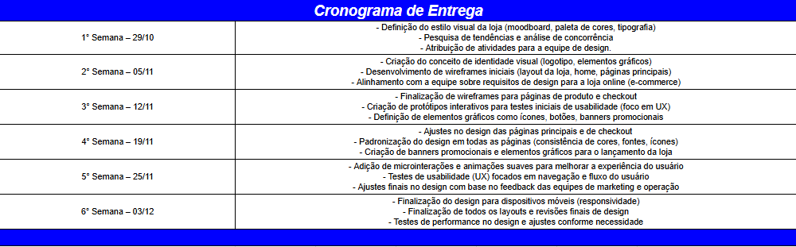
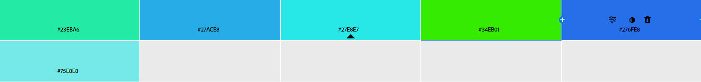

# 💡Projeto E-Commerce PrestaShop Plataform.

## 📃Documentação da equipe de Desing para comprovação de tarefas realizadas Assim como especifições e detalhes.

## 👨🏾‍🏫Professor.
* Celso de Oliveira

## 👨🏼‍💻Integrantes do projeto.
* Vagner Ferreira
* Guilherme Holm
* Eduardo Arpelau
* Renan Paraguaio
* Amanda Beatriz
* Carol
* Tay

## 🕗Cronograma de Entrega

---

# ☝️Tópicos Abordados

## 📋Pesquisa de Mercado e Análise de Concorrentes.

### Perfil do Mercado de Peças Eletrônicas

O mercado de peças eletrônicas online está em constante crescimento, impulsionado pela demanda por reparos de dispositivos eletrônicos, upgrades de PCs, manutenção de eletrodomésticos e a busca por peças raras e de reposição. Além disso, o aumento do consumo de gadgets e tecnologias emergentes fortalece essa demanda.

### 1. Tendências do Mercado:
- **Crescimento do mercado de reparos**: A manutenção de produtos eletrônicos, como smartphones, laptops e dispositivos domésticos, está em alta.
- **Sustentabilidade e peças de reposição**: A preferência por reparar dispositivos ao invés de substituí-los está crescendo, impulsionando a demanda por peças de reposição.
- **Automação e Internet das Coisas (IoT)**: Aumento da necessidade de peças específicas para dispositivos conectados e novos aparelhos tecnológicos.

### 2. Segmentação de Mercado

O público-alvo de um e-commerce de peças eletrônicas pode ser segmentado em diversos grupos:

- **Consumidores finais**: Pessoas que procuram peças para reparar seus próprios dispositivos, como smartphones, computadores, TVs, etc.
- **Técnicos de reparo e oficinas**: Profissionais que compram em grande escala para serviços de reparo.
- **Fabricantes e empresas**: Empresas que necessitam de peças específicas para produção ou montagem de dispositivos eletrônicos.
- **Entusiastas e gamers**: Pessoas que buscam peças específicas, como placas-mãe, processadores e placas gráficas para upgrades de PCs.

### 3. Concorrência no Mercado de E-commerce de Peças Eletrônicas

Os concorrentes principais em um e-commerce de peças eletrônicas variam entre empresas de grande porte e plataformas de nicho.

### Concorrentes Diretos:
 
   
   - **Pontos fortes**: Plataforma consolidada, grande tráfego de usuários, sistema de pagamento integrado.
   - **Pontos fracos**: Alta competição, preços pouco controláveis, vendedores diversos que podem impactar a confiabilidade.

 

   - **Pontos fortes**: Grande variedade de peças, preços competitivos, globalização (peças de fornecedores internacionais).
   - **Pontos fracos**: Prazo de entrega longo, problemas de taxação, comunicação difícil com alguns vendedores.

 

   - **Pontos fortes**: Reputação, facilidade de navegação, grande quantidade de avaliações de consumidores, plataforma segura.
   - **Pontos fracos**: A concorrência no marketplace é intensa, pode haver variação no preço entre os vendedores.

 

   - **Pontos fortes**: Foco em tecnologia e eletrônicos, presença consolidada no Brasil, entrega rápida.
   - **Pontos fracos**: Preço alto devido à marca consolidada, variedade limitada de peças específicas.

### Concorrentes Indiretos:

1. **Lojas físicas e lojas de bairro**: Algumas pequenas lojas de eletrônicos podem oferecer peças para reparo, com atendimento personalizado.
2. **Plataformas especializadas**: Empresas como **ePecas** ou **Manoel El**.

---

## 📋Definição da paleta de cores e tipografia.

### Paleta.

### Tipografia.

## 📋Desenvolvimento de Moodboard

## 📋Criação de protótipos de telas

## 📋Definir identidade visual da loja

## 📋Criação do logo e elementos gráficos

## 📋Definir estilo visual da loja

## 📋Criação de wireframes da loja

## 📋Design de páginas de produto

## 📋Design de banners promocionais

## 📋Mockups de páginas de checkout

## 📋Criação do layout final (home, categorias, etc.)

## 📋Implementação de microinterações e animações

## 📋Testes de usabilidade (UX)	

  
