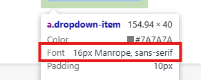
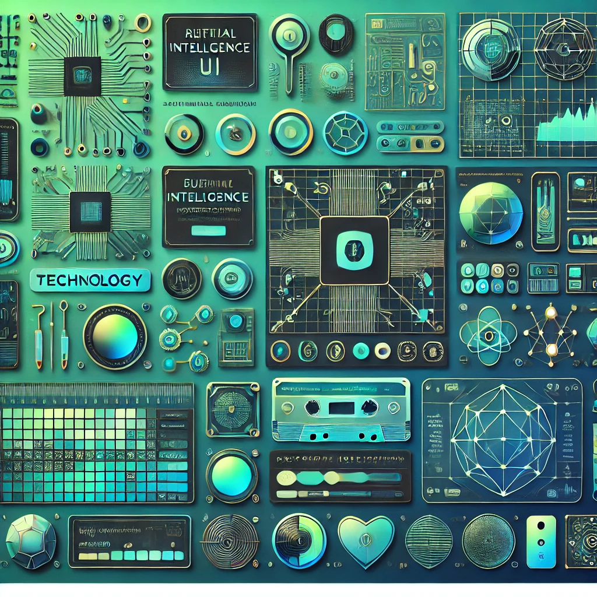
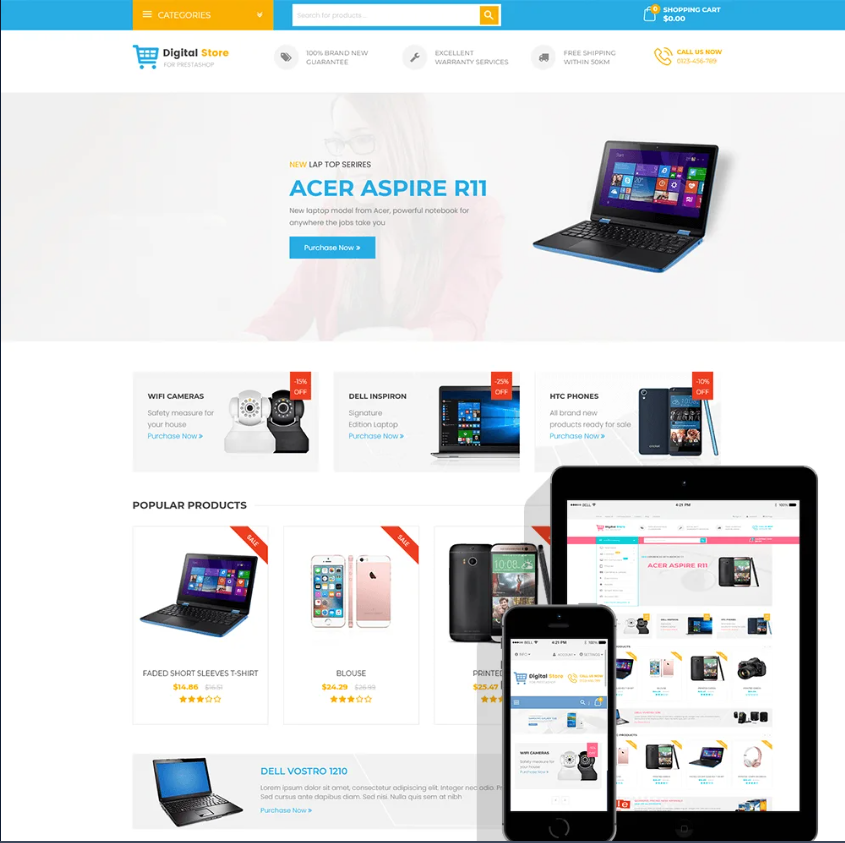
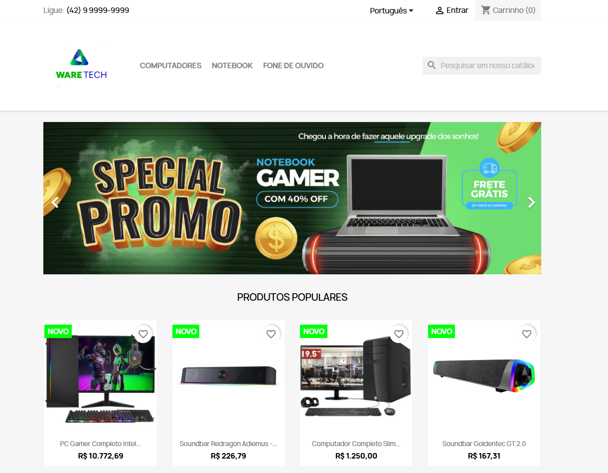

# 💡Projeto E-Commerce PrestaShop Plataforma

## 📃 Documentação da Equipe de Design para Comprovação de Tarefas Realizadas, Especificações e Detalhes.

## 👨🏾‍🏫 Professor:
* Celso de Oliveira

## 👨🏼‍💻 Integrantes do Projeto:
* Vagner Ferreira
* Guilherme Holm
* Eduardo Arpelau
* Renan Paraguaio
* Amanda Beatriz
* Carol
* Tay

## 🕗 Cronograma de Entrega

---

# ☝️ Tópicos Abordados

Aqui estão os tópicos abordados no nosso projeto. Clique em cada título para ir diretamente para a seção correspondente:

1. [📋 Pesquisa de Mercado e Análise de Concorrentes](#pesquisa-de-mercado-e-análise-de-concorrentes)
2. [📋 Definição da Paleta de Cores e Tipografia](#definição-da-paleta-de-cores-e-tipografia)
3. [📋 Desenvolvimento de Moodboard](#desenvolvimento-de-moodboard)
4. [📋 Criação de Protótipos de Telas & Definir Identidade Visual da Loja](#criação-de-protótipos-de-telas-definir-identidade-visual-da-loja)
5. [📋 Criação do Logo e Elementos Gráficos](#criação-do-logo-e-elementos-gráficos)
6. [📋 Definir Estilo Visual da Loja](#definir-estilo-visual-da-loja)
7. [📋 Criação de Wireframes da Loja](#criação-de-wireframes-da-loja)
8. [📋 Design de Páginas de Produto](#design-de-páginas-de-produto)
9. [📋 Design de Banners Promocionais](#design-de-banners-promocionais)
10. [📋 Mockups de Páginas de Checkout](#mockups-de-páginas-de-checkout)
11. [📋 Criação do Layout Final (Home, Categorias, etc.)](#criação-do-layout-final-home-categorias-etc)
12. [📋 Implementação de Microinterações e Animações](#implementação-de-microinterações-e-animações)
13. [📋 Testes de Usabilidade (UX)](#testes-de-usabilidade-ux)

---

## 📋 Pesquisa de Mercado e Análise de Concorrentes
Aqui detalhamos a pesquisa sobre o mercado de peças eletrônicas, incluindo análise de concorrentes e tendências.

### Perfil do Mercado de Peças Eletrônicas

O mercado de peças eletrônicas online está em constante crescimento, impulsionado pela demanda por reparos de dispositivos eletrônicos, upgrades de PCs, manutenção de eletrodomésticos e a busca por peças raras e de reposição. Além disso, o aumento do consumo de gadgets e tecnologias emergentes fortalece essa demanda.

### 1. Tendências do Mercado:
- **Crescimento do mercado de reparos**: A manutenção de produtos eletrônicos, como smartphones, laptops e dispositivos domésticos, está em alta.
- **Sustentabilidade e peças de reposição**: A preferência por reparar dispositivos ao invés de substituí-los está crescendo, impulsionando a demanda por peças de reposição.
- **Automação e Internet das Coisas (IoT)**: Aumento da necessidade de peças específicas para dispositivos conectados e novos aparelhos tecnológicos.

### 2. Segmentação de Mercado

O público-alvo de um e-commerce de peças eletrônicas pode ser segmentado em diversos grupos:

- **Consumidores finais**: Pessoas que procuram peças para reparar seus próprios dispositivos, como smartphones, computadores, TVs, etc.
- **Técnicos de reparo e oficinas**: Profissionais que compram em grande escala para serviços de reparo.
- **Fabricantes e empresas**: Empresas que necessitam de peças específicas para produção ou montagem de dispositivos eletrônicos.
- **Entusiastas e gamers**: Pessoas que buscam peças específicas, como placas-mãe, processadores e placas gráficas para upgrades de PCs.

### 3. Concorrência no Mercado de E-commerce de Peças Eletrônicas

Os concorrentes principais em um e-commerce de peças eletrônicas variam entre empresas de grande porte e plataformas de nicho.

### Concorrentes Diretos:
 
   
   - **Pontos fortes**: Plataforma consolidada, grande tráfego de usuários, sistema de pagamento integrado.
   - **Pontos fracos**: Alta competição, preços pouco controláveis, vendedores diversos que podem impactar a confiabilidade.

 

   - **Pontos fortes**: Grande variedade de peças, preços competitivos, globalização (peças de fornecedores internacionais).
   - **Pontos fracos**: Prazo de entrega longo, problemas de taxação, comunicação difícil com alguns vendedores.

 

   - **Pontos fortes**: Reputação, facilidade de navegação, grande quantidade de avaliações de consumidores, plataforma segura.
   - **Pontos fracos**: A concorrência no marketplace é intensa, pode haver variação no preço entre os vendedores.

 

   - **Pontos fortes**: Foco em tecnologia e eletrônicos, presença consolidada no Brasil, entrega rápida.
   - **Pontos fracos**: Preço alto devido à marca consolidada, variedade limitada de peças específicas.

### Concorrentes Indiretos:

1. **Lojas físicas e lojas de bairro**: Algumas pequenas lojas de eletrônicos podem oferecer peças para reparo, com atendimento personalizado.
2. **Plataformas especializadas**: Empresas como **ePecas** ou **Manoel El**.

---

## 📋 Definição da Paleta de Cores e Tipografia
Apresentamos as escolhas de cores e fontes que definem a identidade visual do projeto.

* Paleta de cores

* Tipografia

---

## 📋 Desenvolvimento de Moodboard
A criação do moodboard foi feita com o auxílio de inteligência artificial para inspirar o estilo visual da loja.

---

## 📋 Criação de Protótipos de Telas & Definir Identidade Visual da Loja
Aqui mostramos os protótipos iniciais de telas e a definição de toda a identidade visual da loja.

---

## 📋 Criação do Logo e Elementos Gráficos
O design do logo e outros elementos gráficos essenciais para o e-commerce foram desenvolvidos para refletir a identidade da marca. O nome "Ware" remete a hardware, simbolizando a essência de produtos tecnológicos, enquanto "Tech" destaca o foco em soluções de ponta.

---

## 📋 Definir Estilo Visual da Loja
Definimos o estilo visual, levando em conta a experiência do usuário e a estética desejada para a loja online.

---

## 📋 Criação de Wireframes da Loja
Os wireframes foram criados para planejar a estrutura e o layout da loja.

---

## 📋 Design de Páginas de Produto
Desenvolvemos o design das páginas de produtos com foco na clareza e usabilidade.

---

## 📋 Design de Banners Promocionais
Criamos banners promocionais atrativos para incentivar a compra e destacar ofertas.

---

## 📋 Mockups de Páginas de Checkout
Os mockups das páginas de checkout foram projetados para facilitar a navegação e aumentar as conversões.

---

## 📋 Criação do Layout Final (Home, Categorias, etc.)
Desenvolvemos o layout final, incluindo as páginas principais como a home e categorias de produtos.

---

## 📋 Implementação de Microinterações e Animações
As microinterações e animações foram implementadas para melhorar a experiência do usuário e tornar o site mais dinâmico.

---

## 📋 Testes de Usabilidade (UX)
Realizamos testes de usabilidade para garantir que o site ofereça uma navegação fácil e intuitiva para os usuários.
